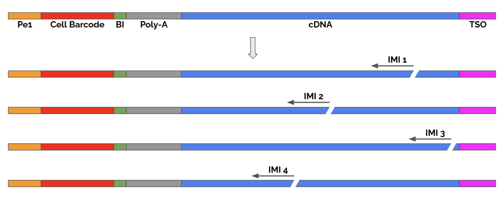

# 1.试剂盒

PIP-Seq珠子包含 $10^8$ ($9^{64}$) 个唯一条形码，为标记 100 万个细胞提供了充足的序列空间。

| 名称     | T2                                                            | T10                  | T20                       | T100                |
|--------|---------------------------------------------------------------|----------------------|---------------------------|---------------------|
| 细胞数量   | 2000                                                          | 10000                | 20000                     | 100000              |
| read depth | load 5K cells,100M reads per sample                           | 17K cells,340M reads | load 40K cells,800M reads | 200k cells,2B reads |
| Notes  | identification of subpopulations ≥ 20% of all cells or nuclei | ≥ 10%                | ≥ 5%                      | ≥ 1%                |

**it is recommended to start with a depth of 20,000 reads per input cell**

# 2.培训视频

[Illumina Single Cell Prep training page](https://support.illumina.com.cn/sequencing/sequencing_kits/illumina-single-cell-prep/training.html)

# 3.数据预处理PIPseeker(以后可能不再更新) or DRAGEN single Cell RNA App v4.4

PIPseeker算法解析，输出结果分为5个等级，算法如下：

[PIPseeker-v3.3-User-Guide.pdf](./PIPseeker/PIPseeker-v3.3-User-Guide.pdf)

输出文件：

<output path>/metrics/barcode_stats.csv

<output path>/metrics/barcodes/barcode_whitelist.txt

<output path>/metrics/barcodes/generated_barcode_read_info_table.csv

<output path>/barcoded_fastqs/*Intermediate FASTQ file(s)

The raw matrix is contained in the files:**matrix.mtx.gz**、**barcodes.tsv.gz**、**features.tsv.gz**, all inside <output path>/raw_matrix. The format of the matrix is compatible with standard downstream analysis tools, e.g., Seurat.

# 4.高级分析Partek Flow software

关于Partek Flow：https://sapac.illumina.com/products/by-type/informatics-products/partek-flow.html

[Best Practices for Agilent PartekFlow Paired-end RNASeq Pipelines.pdf](./PartekFlow/Best_Practices_for_Agilent_PartekFlow_Paired-end_RNASeq_Pipelines.pdf)

# 5.数据预处理PIPseeker_Report.html报告模版

[PIPseeker_Report](./PIPseeker/PIPseeker_Report.html)

# 6.单细胞测序商业化产品评估

[De Simone M, Hoover J, Lau J, et al. A comprehensive analysis framework for evaluating commercial single-cell RNA sequencing technologies[J]. Nucleic Acids Research, 2024: gkae1186.](https://academic.oup.com/nar/advance-article/doi/10.1093/nar/gkae1186/7924191?login=false)

# 8.文库结构

**read 1:at least 45 cycles**

**read 2:at least 72 cycles**

个人理解：read 1:3-base “binning index” (BI）+read 2:Intrinsic Molecular Identifiers (IMIs)  总称为原先的UMI用来去掉PCR冗余带来的影响

IMIs 就是在文库制备PCR之前加入随机位点的剪切酶，这样对于一个转录本4个拷贝的时候，通过随机剪切酶，然后会切到不同的位置，从而会得到不同的read2,在数据分析的时候IMIs 会设置为12bp

DRAGEN数据分析参考链接：https://help.dragen.illumina.com/product-guides/dragen-v4.4/dragen-single-cell-pipeline/dragen-scrna-pipseq

# 9.测序建议

NextSeq 500/550 recommended final library loading concentration 1.6 pM including ≥ 1% PhiX

NextSeq 2000 recommended final library loading concentration: 550 pM including ≥ 1% PhiX.

NovaSeq 6000 final library loading concentration 210 pM including ≥ 1% PhiX (equivalent to Pooled Loading Concentration of 1.05 nM).

NovaSeq X Series final library loading concentration 190 - 200 pM including ≥ 2% PhiX.

# 10.blc2fastq拆分：single-cell analysis software does not require trimmed fastq.gz files.

**no QC or adapter trimming when converting BCL to fastq.gz files**

# 11.Single-Cell Isoform Sequencing of Fluent Libraries with MAS-seq 

三代全长也可以来自Broad CLINICAL LABS验证:https://broadclinicallabs.org/single-cell-isoform-sequencing-of-fluent-libraries-with-mas-seq/

# 12.PIPSeeker参考基因组构建

PIPseeker utilizes the STAR package for read alignment. Custom references can be built with STAR v2.7.4a or greater using the **--runMode** genomeGenerate option, as described in the STAR manual.

[details:Instructions for Creating Custom PIPseeker™ References](./PIPInstructions-for-Creating-Custom-PIPseeker-References-1.pdf)

# 13.经典文章链接

[Clark I C, Fontanez K M, Meltzer R H, et al. Microfluidics-free single-cell genomics with templated emulsification[J]. Nature Biotechnology, 2023, 41(11): 1557-1566.](https://www.nature.com/articles/s41587-023-01685-z)

# 14.基于最新的PIPseq V发表的文章

[Fontanez K, Agam Y, Bevans S, et al. Intrinsic molecular identifiers enable robust molecular counting in single-cell sequencing[J]. bioRxiv, 2024: 2024.10. 04.616561.](https://www.biorxiv.org/content/10.1101/2024.10.04.616561v1.full)

# Publication

[Hargrove-Wiley E, Obodo D, Bindeman W, et al. Elucidating Sex-Specific Immune Profiles in a Breast Cancer Model[J]. International Journal of Molecular Sciences, 2024, 25(23): 13113.](https://www.mdpi.com/1422-0067/25/23/13113)

[Frazel P W, Fricano-Kugler K, May-Zhang A A, et al. Single-cell analysis of the nervous system at small and large scales with instant partitions[J]. bioRxiv, 2023: 2023.07. 14.549051.](https://www.biorxiv.org/content/10.1101/2023.07.14.549051v2.abstract)

[Huang Y A, Wang X, Kim J C, et al. PIP-seq identifies novel heterogeneous lung innate lymphocyte population activation after combustion product exposure[J]. Scientific Reports, 2024, 14(1): 20167.](https://www.nature.com/articles/s41598-024-70880-y)

[Kim H, Jang B, Zhang C, et al. Targeting stem cells and dysplastic features with dual MEK/ERK and STAT3 suppression in gastric carcinogenesis[J]. Gastroenterology, 2024, 166(1): 117-131.](https://www.sciencedirect.com/science/article/pii/S0016508523050758)

[Lee S H, Won Y, Gibbs D, et al. Amphiregulin switches progenitor cell fate for lineage commitment during gastric mucosal regeneration[J]. Gastroenterology, 2024.](https://www.sciencedirect.com/science/article/pii/S0016508524002907)

[Peretz C A C, Kennedy V E, Walia A, et al. Multiomic single cell sequencing identifies stemlike nature of mixed phenotype acute leukemia[J]. Nature Communications, 2024, 15(1): 8191.](https://www.nature.com/articles/s41467-024-52317-2)