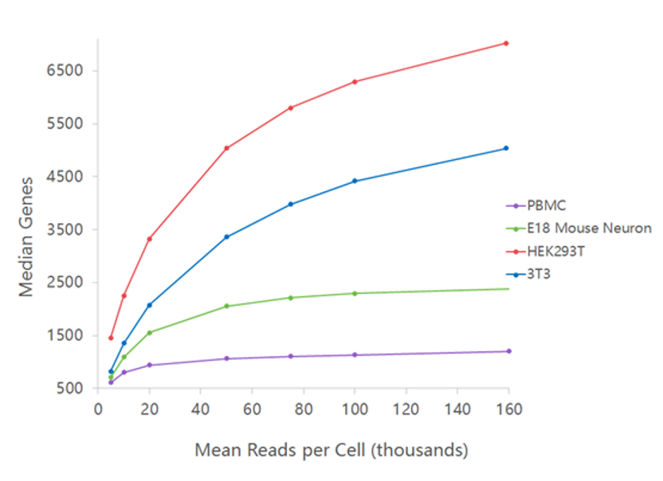
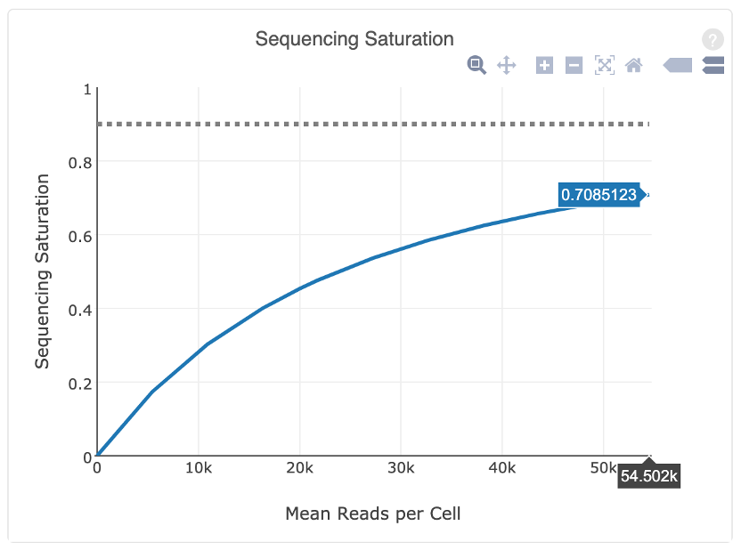

测序饱和度衡量的是在实验中测序了多少文库的复杂度。
不同细胞类型的 RNA 含量不同，因此文库中的转录本数量也不同。
随着测序深度增加，检测到的基因数量会增加，但不同细胞类型的饱和度会在不同的测序深度达到。
测序深度越高，通常能检测到更多的唯一转录本，但这一点会受到文库复杂度的限制。

Sequencing Saturation该指标量化了来自已经观察到的 UMI（唯一分子标识符）的 reads 所占的比例。更具体来说，这是来自有效细胞条形码（cell-barcode）和有效 UMI 组合的有信心比对 reads 中，非唯一的比例（与已有的细胞条形码、UMI、基因组合匹配的比例）。
该指标的计算公式如下：
<pre>
Sequencing Saturation = 1 - (n_deduped_reads / n_reads)
</pre>

**unique_confidently_mapped_reads**

<pre>samtools view pbmc_1k_v3_possorted_genome_bam.bam | grep 'xf:i:25' | wc -l </pre>

如果测序饱和度为 50%，则意味着每 2 个 reads 中就有 1 个 UMI 计数（细胞条形码中的唯一转录本）。相反，90% 的测序饱和度意味着每 10 个 reads 中就有 1 个 UMI 计数。如果目标是检测低表达的转录本，则需要超过 90% 的测序饱和度。如果目标是划分细胞类型，较低的测序饱和度是可以接受的。

[How-much-sequencing-saturation-should-I-aim-for](https://kb.10xgenomics.com/hc/en-us/articles/115002474263-How-much-sequencing-saturation-should-I-aim-for)

[How-is-sequencing-saturation-calculated](https://kb.10xgenomics.com/hc/en-us/articles/115003646912-How-is-sequencing-saturation-calculated)

[What-is-sequencing-saturation](https://kb.10xgenomics.com/hc/en-us/articles/115005062366-What-is-sequencing-saturation)

