# 单细胞测序学习笔记

## 1.单细胞RNA测序(Single-Cell RNA-seq)+单核测序（Single-nucleus RNA-seq）

已有研究表明，细胞核能够准确反映细胞的所有转录模式在实验设计中选择单细胞还是单核测序主要由组织样本类型驱动，单细胞测序高度依赖新鲜组织，需保持细胞活性。

|	| 单核测序 (snRNA-seq)	                 | 单细胞测序 (scRNA-seq)                  |
|----|-----------------------------------|------------------------------------|
|目标	| 分离和富集细胞核                          | 	分离和富集完整单细胞                        |
|样本起始状态| 	新鲜或冷冻组织、易损组织（如大脑）                         | 	通常需要新鲜组织、易解离（如血液）                         |
|主要步骤| 	组织破碎 → 核分离 → 核富集 → RNA提取 → 文库构建	 | 组织解离 → 单细胞悬液 → 细胞富集 → RNA提取 → 文库构建 |
|下游测序| 	与单细胞测序类似（如10X Genomics）	         | 与单核测序类似（如10X Genomics）             |
|内含子比例	| 高（>50%）                           | 	低（<10%）                           |

## 2.工作流程

包括分离单细胞（或细胞核）、将RNA转化为cDNA、制备测序文库（Illumina）并进行测序。 主要在通量（每次实验捕获多少细胞）、定量类型（全长或基于标签）以及成本方面有所不同。

SMART-seq2 是一种流行的低通量方法，提供全长转录本定量。它非常适合详细研究较小群体的细胞（例如，差异性异构体使用、低表达转录本的表征）。

Chromium 是一种流行的高通量方法，使用唯一分子标识符（UMI）进行转录本定量（从3’端或5’端）。它非常适合研究高度异质的组织并大规模采样大量细胞。

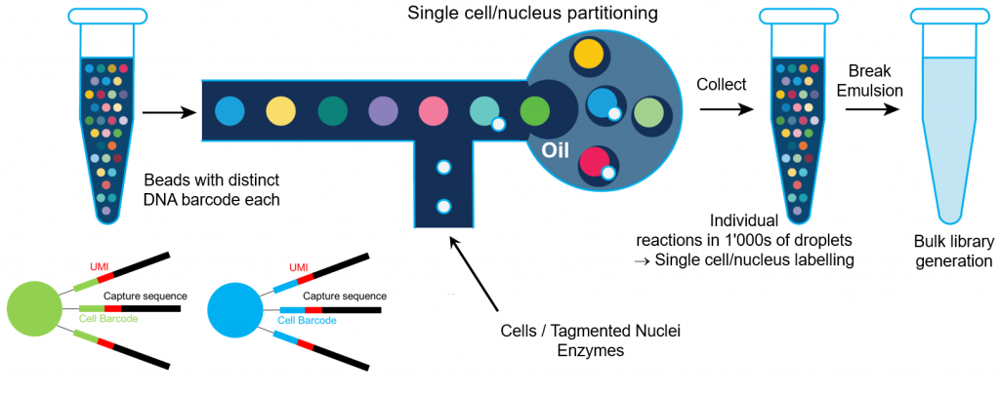

## 3.bioinformatics

*Roadmap for typical single-cell RNA sequencing data analysis*

*Overview of the analysis modules for single-cell RNA sequencing data analysis*

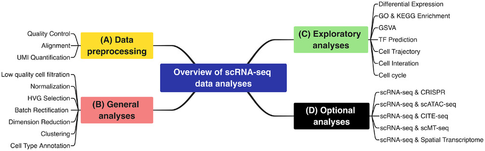

[Jovic D, Liang X, Zeng H, et al. Single‐cell RNA sequencing technologies and applications: A brief overview[J]. Clinical and translational medicine, 2022, 12(3): e694.](https://onlinelibrary.wiley.com/doi/full/10.1002/ctm2.694)

### 3-0:[Raw data processing](https://www.sc-best-practices.org/introduction/raw_data_processing.html)

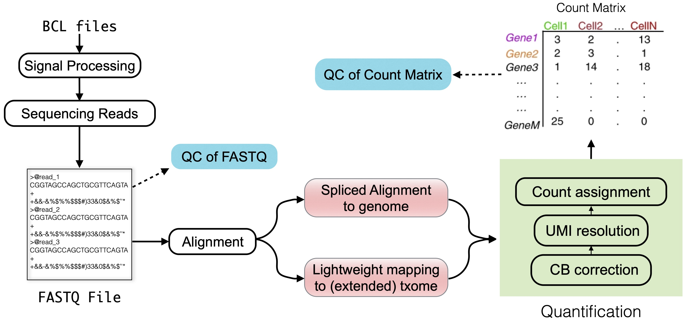

**关于参考基因组**

        two popular sources of assembly files: UCSC (their assemblies are named hg19, hg38, mm10, etc), and GRC (GRCh37, GRCh38, GRCm38)这两个版本在染色体水平的序列区别不大，differ in additional contigs and so-called ALT loci,

**关于注释文件**

        human and mouse genome annotation are RefSeq, ENSEMBL, and GENCODE. 
        Current ENSEMBL/GENCODE annotation of the human genome contains approximately 60k genes, 20k of which are protein coding, and 237k transcripts.
        简单的来讲大多数基因可以分为：protein coding genes, long noncoding RNAs, short noncoding RNAs, and pseudogenes.
        在cell ranger中保留了 protein coding, long noncoding RNA, antisense, and all biotypes belonging to BCR/TCR (i.e. V/D/J) genes (note that older Cell Ranger reference versions do not include the latter). All pseudogenes and small noncoding RNAs are removed.

**非模式生物注意两点**

        好的参考基因组以及注释好的线粒体序列，MITOS2 is a specialized server that can be used to automatically generate good quality mitochondrial annotations for metazoans. de novo sequenced genomes generate gene models that do not include UTR sequences这样会影响比对效果

### 3-1：mapping

Cell Ranger、STARsolo, Kallisto, Alevin, and Alevin-fry,Summary of the results for each evaluated section of interest and mapper. Good results are coloured in green, intermediate in yellow, and poor results in red.

**STARsolo** and **Alevin-full_decoy** offer great computational speed-up and correct processing of multimappers, which reduces the quantification bias while retaining very high compatibility with Cell Ranger.

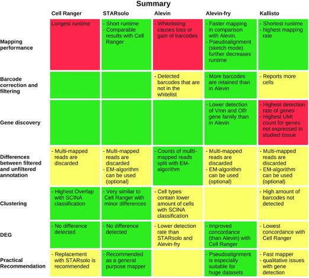

[Brüning R S, Tombor L, Schulz M H, et al. Comparative analysis of common alignment tools for single-cell RNA sequencing[J]. Gigascience, 2022, 11: giac001.](https://academic.oup.com/gigascience/article/doi/10.1093/gigascience/giac001/6515741?login=true)

cell ranger必须用最新版如下图：

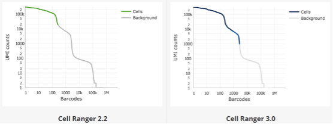

Cell Ranger 使用转录本注释 GTF 文件将 reads 分类为外显子区（exonic）、内含子区（intronic）和基因间区（intergenic），如果一个 read 至少有 50% 与外显子区域重叠，则被归类为外显子区；
如果它不属于外显子区但与内含子区域重叠，则被归类为内含子区；否则，被归类为基因间区。如果某个 read 既能比对到单个外显子位点，同时也能比对到一个或多个非外显子位点，则优先考虑外显子位点，并将该 read 视为高置信度地比对到该外显子位点，并赋予最高的比对质量评分。
默认情况下，属于转录组（在下图中标记为蓝色）的 reads 会被保留用于 UMI 计数。只有能够唯一比对到单个基因的 reads 才会被保留用于 UMI 计数，而多重比对的 reads 会被 Cell Ranger 丢弃。

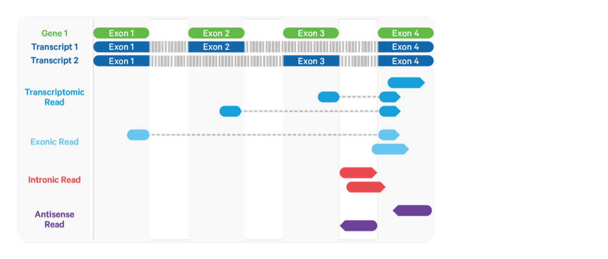

当测序样本为细胞核（nuclei）时，大量 reads 来自未剪接的转录本，并比对到内含子区域。为了将这些内含子 reads 计入 UMI 计数，可以在运行 cell ranger count 和 cell ranger multi 管道时使用 --include-introns 选项。如果启用了该选项，则所有以正义链方向比对到单个基因的 reads（包括上图中标记为转录组的蓝色 reads、外显子区的浅蓝色 reads 和内含子区的红色 reads）都会被保留用于 UMI 计数。使用 --include-introns 选项后，无需额外创建自定义的 “pre-mRNA” 参考基因组（该参考基因组通常会将整个基因体定义为外显子）。

### 3-2:considerations_in_Quality control
**Seurat script**

    library(dplyr)
    library(Seurat)
    library(patchwork)
    
    # Load the PBMC dataset
    pbmc.data <- Read10X(data.dir = "/brahms/mollag/practice/filtered_gene_bc_matrices/hg19/")
    # Initialize the Seurat object with the raw (non-normalized data).
    pbmc <- CreateSeuratObject(counts = pbmc.data, project = "pbmc3k", min.cells = 3, min.features = 200)
    pbmc[["percent.mt"]] <- PercentageFeatureSet(pbmc, pattern = "^MT-")
    VlnPlot(pbmc, features = c("nFeature_RNA", "nCount_RNA", "percent.mt"), ncol = 3)

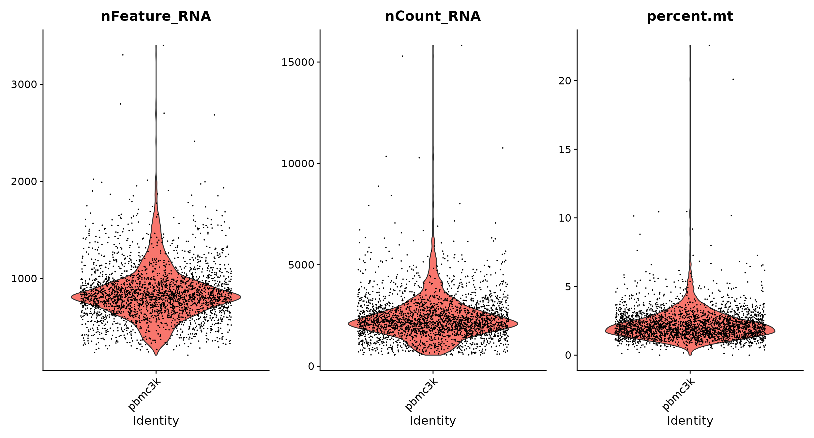

    plot1 <- FeatureScatter(pbmc, feature1 = "nCount_RNA", feature2 = "percent.mt")
    plot2 <- FeatureScatter(pbmc, feature1 = "nCount_RNA", feature2 = "nFeature_RNA")
    plot1 + plot2

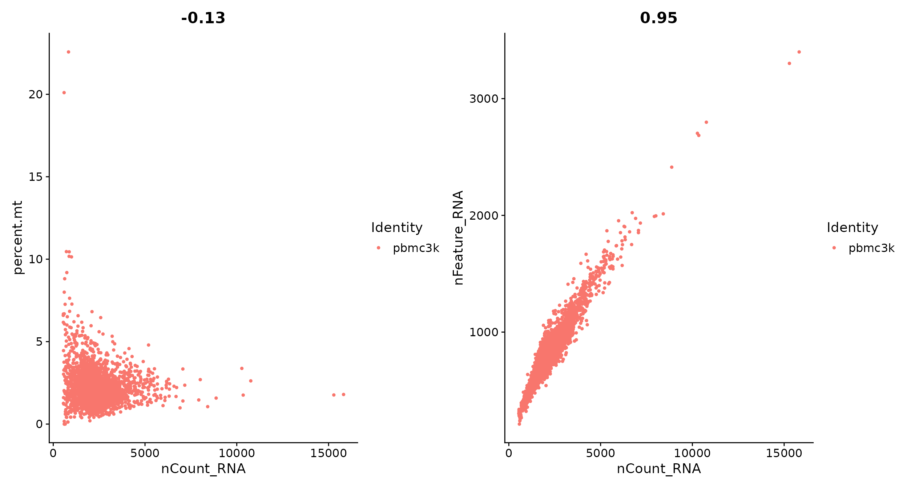
    
    pbmc <- subset(pbmc, subset = nFeature_RNA > 200 & nFeature_RNA < 2500 & percent.mt < 5)

常见的细胞质量控制 (QC) 步骤主要基于以下三个指标：

        每个条形码的 UMI 计数深度 (count depth)
        每个条形码检测到的基因数 (gene count per barcode)
        每个条形码中线粒体基因 UMI 计数的比例 (fraction of mitochondrial counts per barcode)

这些异常条形码可能对应于：

        凋亡细胞 (dying cells)、细胞膜破损的细胞 (cells with broken membranes)：条形码的 UMI 计数低、检测到的基因数少、但线粒体基因占比高，则可能是细胞膜破损导致胞质mRNA泄漏，仅剩线粒体mRNA被保留下来。 但UMI计数较低、基因数较少的细胞，也可能属于静息 (quiescent) 细胞群，并非一定是低质量细胞
        多胞 (doublets, 即两个或多个细胞的 mRNA 被误认为是单个细胞的表达数据)：UMI计数异常高、检测到的基因数异常多，可能代表多胞，通常需要设定高UMI计数阈值来过滤掉潜在的多胞。但UMI计数较高的细胞，可能只是细胞体积较大，并不一定是多胞。

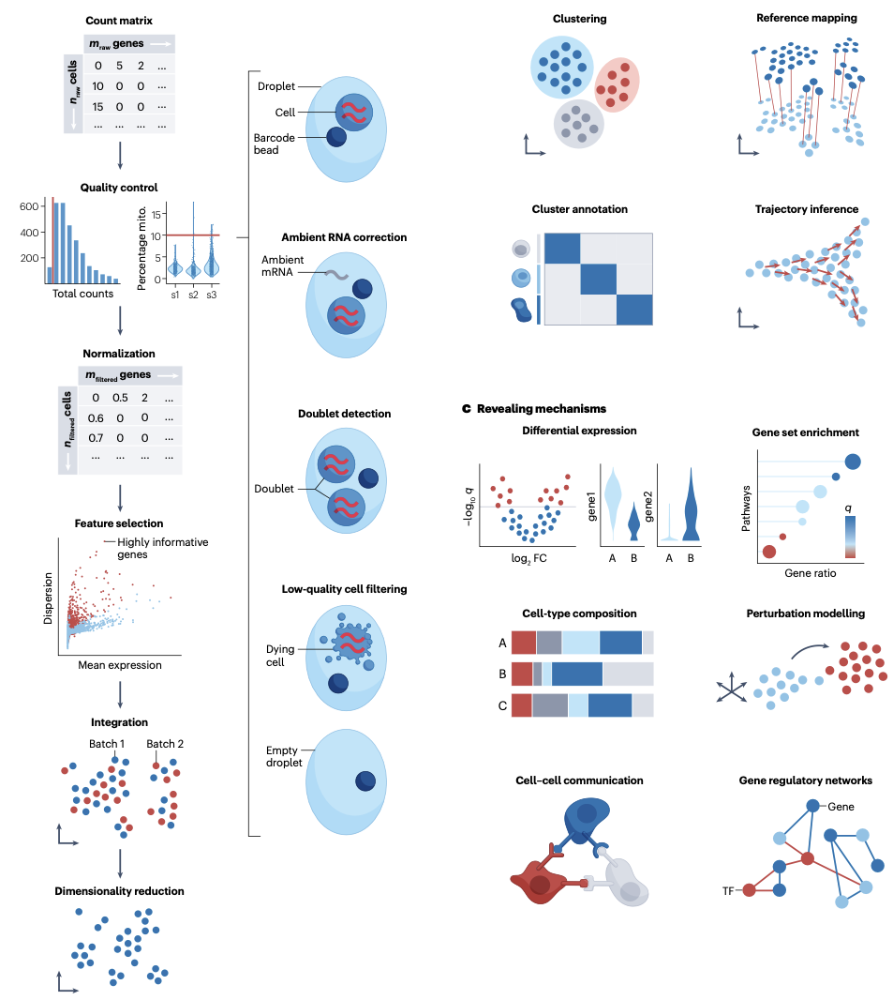

There is no absolute standard for the setting of filter thresholds, which usually depends on the type of cell and tissue being analysed. Lambrechts et al. filtered out cells with ≤ 100 or ≥ 6000 expressed genes, ≤ 200 UMIs and ≥ 10% mitochondrial genes as described in their study. Fan et al. retained good quality cells using the following parameters: (1) 200 < total number of expressed genes per cell (nGenes) < 2500; (2) 300 < total number of UMIs per cell (nUMIs) < 15000; and (3) percentage of UMIs mapped to mitochondrial genes (MT%) < 10%.

[Kim G D, Lim C, Park J. A practical handbook on single-cell RNA sequencing data quality control and downstream analysis[J]. Molecules and Cells, 2024, 47(9): 100103.](https://www.sciencedirect.com/science/article/pii/S1016847824001286)

### 3-3:Mitochondrial gene content cutoff

线粒体基因比例较高的细胞，可能参与呼吸代谢 (respiratory processes)，并不一定是死细胞。 因此，在设定QC阈值时，应该联合多个QC指标进行筛选，并尽量使用宽松的阈值，以免误删真正的细胞群体。未来，可以使用多变量QC依赖性模型来提高QC筛选的灵敏度。

线粒体基因比例超过 5% 至 15% 的细胞被视为低质量细胞并予以剔除。然而，基于线粒体基因比例去除细胞的标准可能因物种、样本类型和实验条件等因素而有所不同。例如，与小鼠相比，人类样本通常表现出更高比例的线粒体基因，而新陈代谢高度活跃的组织（如肾脏）可能会显示出较强的线粒体基因表达。

例如，在能量需求较低的组织中30% 的线粒体mRNA可能表明细胞应激或凋亡，而对于能量需求较高的健康心肌细胞来说，这一比例是正常的。线粒体转录本并不会在细胞核中表达。然而，在 snRNA-seq 数据中，仍然检测到不同数量的线粒体转录本。

*A recent systematic survey of scRNA-seq data suggested that a mitochondrial proportion threshold of 10% is appropriate to distinguish between healthy and low-quality cells in most human tissues, while in mouse tissues, the recommended threshold is 5%.*

[Osorio D, Cai JJ. Systematic determination of the mitochondrial proportion in human and mice tissues for single-cell RNA-sequencing data quality control[J]. Bioinformatics, 2021, 37(7): 963-967.](https://academic.oup.com/bioinformatics/article/37/7/963/5896986?login=false)

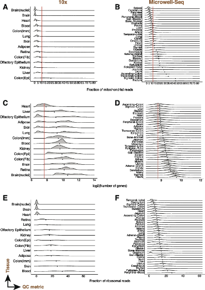

QC metrics vary by tissue. (X-axis) Fraction of mitochondrial reads (A, B), gene complexity (C, D), and percentage of ribosomal protein genes (E, F) per cell across human tissues (Y-axis) and technologies. Various human tissue scRNA-seq datasets generated by 10X droplet-based (A, C, E) and Microwell-seq (B, D, F) technologies. Each row in a panel is a density curve with the mean represented by a blue diamond. Red lines indicate conventional threshold values set at 10% for percentage of mitochondrial reads, and 200 for gene complexity

[Subramanian A, Alperovich M, Yang Y, et al. Biology-inspired data-driven quality control for scientific discovery in single-cell transcriptomics[J]. Genome biology, 2022, 23(1): 267.](https://genomebiology.biomedcentral.com/articles/10.1186/s13059-022-02820-w)

### 3-4:remove background noise(remove_ambient_RNA_contamination)

在单细胞 RNA 测序 (scRNA-seq) 中，空胞指的是： 含有条形码 (barcode) 但没有真正的细胞，仅含有少量环境 RNA (ambient RNA)。 这些 RNA 可能来源于细胞裂解后的游离 RNA，在实验过程中随机进入微滴 (droplet) 或孔板 (well) 中。 在单细胞分离过程中，一些细胞可能受损、破裂或处于凋亡状态，导致其RNA内容物释放到周围的溶液中。溶液中的游离RNA：这些RNA可能悬浮在细胞悬液中，并在液滴形成（如基于液滴的scRNA-seq方法，例如10x Genomics）时被意外封装到其他细胞的液滴中。例如，取样或实验操作过程中引入的外源性RNA

We use our genotype-based estimates to evaluate the performance of three methods (**CellBender, DecontX, SoupX**) that are designed to quantify and remove background noise. We find that CellBender provides the most precise estimates of background noise levels and also yields the highest improvement for marker gene detection.

[Janssen P, Kliesmete Z, Vieth B, et al. The effect of background noise and its removal on the analysis of single-cell expression data[J]. Genome biology, 2023, 24(1): 140.](https://link.springer.com/article/10.1186/s13059-023-02978-x)

### 3-5:Normalization

Ahlmann-Eltze 和 Huber 在 2023 年发表的一项最新基准研究（如下文）对 22 种不同的单细胞数据转换方法进行了比较。结果表明，一种相对简单的方法——加伪计数（pseudo-count）的对数转换（log transformation）结合主成分分析（PCA），在性能上与更复杂的方法相当，甚至更优。在单细胞RNA测序数据分析中，矩阵标志化（normalization）后进行log转化时，通常是以自然对数（底数为e）或以10为底的对数（log10）为主，而以2为底的对数（log2）较少见。

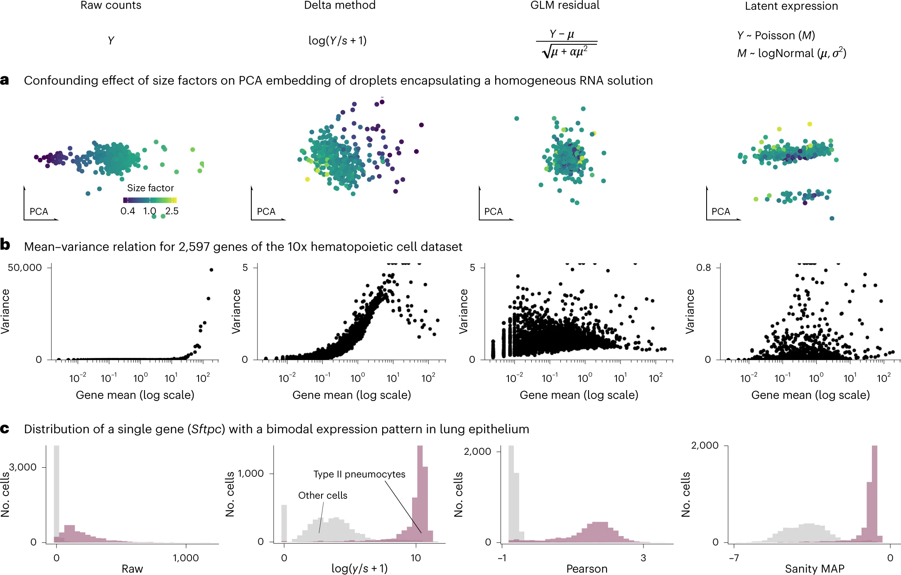

[Ahlmann-Eltze C, Huber W. Comparison of transformations for single-cell RNA-seq data[J]. Nature Methods, 2023, 20(5): 665-672.](https://www.nature.com/articles/s41592-023-01814-1)

**Seurat标准化步骤NormalizeData()：**
Seurat 提供了一种默认的标准化方法 LogNormalize，计算方式为：
将每个细胞的 counts 除以该细胞的总 counts（即测序深度），得到一个归一化的值。乘以一个缩放因子（默认是 10,000，参数 scale.factor 可调）。对结果取自然对数使用 log1p，即 ln(1+x)

        seurat_obj <- NormalizeData(seurat_obj)

**Scanpy标准化步骤scanpy.pp.normalize_total() 和 scanpy.pp.log1p()：**
normalize_total()：将每个细胞的 counts 除以该细胞的总 counts（测序深度），并乘以一个目标和（默认是 1e4，类似 Seurat 的 10,000），生成归一化后的矩阵。log1p()：对归一化后的数据取自然对数ln(1+x)

**备注**:单细胞 RNA-seq 数据中，每个细胞的总 UMI 计数通常在几百到几万之间（例如 1,000 到 50,000）。如果直接用占比（counts / total counts），结果会非常小（例如 10⁻⁵ 到 10⁻³），不便于直观理解和后续计算。 乘以 10,000 后，标准化数据的值通常落在 0 到几百的范围内（经过 log 转化后为 0 到 5 左右），这与基因表达的生物学动态范围较为吻合，也方便可视化（如热图、散点图）。 为什么不用 1,000 或 100,000？如果缩放因子太小（如 1,000），标准化后的值范围会偏小，可能导致 log 转化后的数值过于压缩，丢失分辨率。 如果缩放因子太大（如 100,000），数值范围会过大，log 转化后可能放大噪声，尤其是在低表达基因中。10,000 是一个折中的选择，既不过分压缩也不过分放大，同时保持数据的动态范围适合大多数下游分析（如聚类、差异表达分析）。

### 3-6:highly_variable_gene

单细胞RNA-seq 数据具有以下特点

        高维性：每个细胞可能测定数万个基因的表达量。
        稀疏性：由于技术限制，许多基因在大多数细胞中表达为零（dropout）。
        噪声：数据中存在技术噪声（如测序深度差异）和生物学无关的变异（如管家基因的均匀表达）。

如果直接使用所有基因进行分析：

        计算成本高。
        噪声可能会掩盖生物学信号，导致降维或聚类结果不准确。

因此筛选Highly Variable Genes，HVG高变基因是单细胞数据中表达变异较大的基因，反映细胞间的生物学差异。为了增强PCA对生物学差异的捕捉能力，常规方法会选择表达变化较大的基因，如前2,000个变异最大的基因）

        pbmc <- FindVariableFeatures(pbmc, selection.method = "vst", nfeatures = 2000)

*HVG selection methods can be classified into four categories:*

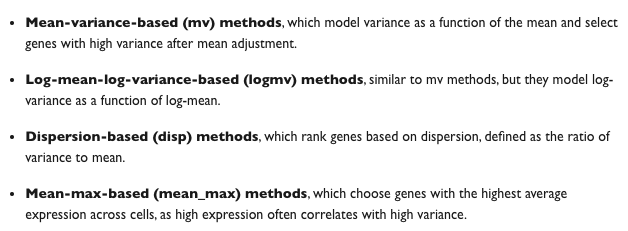

*Classification of baseline HVG selection methods.*

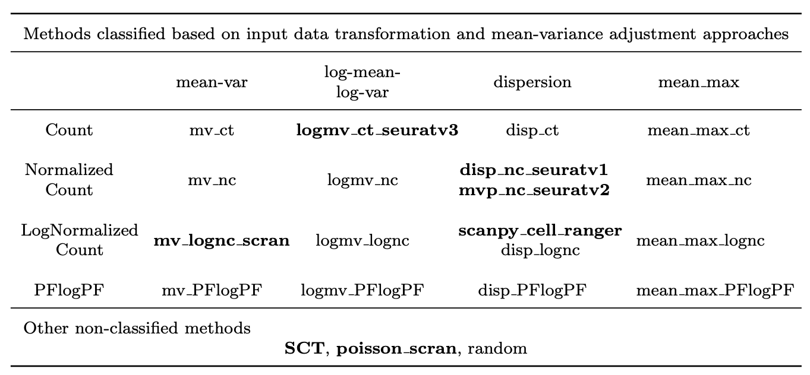

[Zhao R, Lu J, Zhou W, et al. A systematic evaluation of highly variable gene selection methods for single-cell RNA-sequencing[J]. bioRxiv, 2024: 2024.08. 25.608519.](https://www.biorxiv.org/content/10.1101/2024.08.25.608519v1.abstract)

ScaleData通常在NormalizeData（归一化）和FindVariableFeatures（筛选高变异基因）之后、运行RunPCA之前执行。它包括以下步骤：

中心化（Centering）：将每个基因的表达值减去其均值，使均值为0

缩放（Scaling）：将每个基因的表达值除以其标准差，使方差为1

可选的回归（Regress out）：可以选择移除不需要的变异来源，例如细胞周期效应、线粒体基因比例或批次效应（通过参数vars.to.regress指定）

        seurat_obj <- ScaleData(seurat_obj) # 缩放数据 

### 3-7:Dimensionality Reduction:PCA

在scRNA-seq数据分析中，我们通过寻找与已知细胞状态或细胞周期阶段相关的细胞身份来描述数据集中的细胞结构。这一过程通常被称为细胞身份注释。
为此，我们将细胞组织成簇，以推断相似细胞的身份。聚类本身是一个常见的无监督机器学习问题。我们可以通过在降维后的表达空间中最小化簇内距离来得出簇。在这种情况下，表达空间决定了细胞在降维表示下的基因表达相似性。例如，这种低维表示可以通过主成分分析（PCA）确定.
PCA：用于前期降维、去噪或输入下游分析（如聚类），不建议直接用于最终可视化。在我们运行PCA之后，需要决定将哪些主成分（PCs）纳入下游分析。我们希望纳入足够多的PCs以保留生物学信号，但又要尽量减少PCs的数量，以避免数据中的噪声干扰。根据每个主成分解释的方差百分比对主成分进行排名
In this example, we can observe an ‘elbow’ around PC 9-10, suggesting that the majority of true signal is captured in the first 10 PCs.

        pbmc <- RunPCA(pbmc, features = VariableFeatures(object = pbmc))
        ElbowPlot(pbmc)

### 3-8:KNN+SNN(cluster)

KNN是一种基于距离的方法，用于找到每个细胞的“最近邻居”。在单细胞分析中，通常基于细胞的基因表达谱（通常是降维后的数据，比如PCA或t-SNE/UMAP的坐标）来计算细胞之间的距离（如欧几里得距离）。

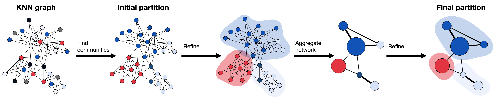

NN-Descent（Nearest Neighbor Descent）是一种高效的KNN搜索算法，通过迭代优化初始的邻居猜测来快速构建近似KNN图。它基于一个假设：“邻居的邻居也很可能是邻居”

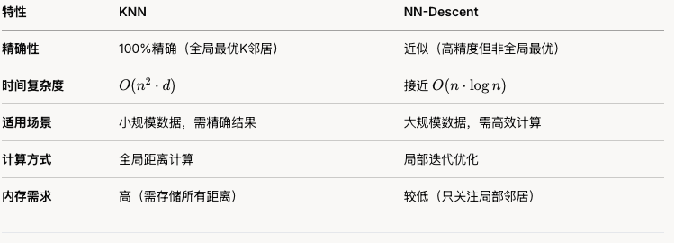

*小型数据集:<10,000细胞*

        可以选择精确KNN，因为计算时间通常在分钟级别，易于处理。
        工具实现：Seurat的默认KNN，或Scanpy中设置use_approx=False。

*中型数据集:10,000-100,000细胞*

        NN-Descent或类似近似算法是更好的选择，兼顾速度和精度。
        工具实现：Scanpy默认设置，或Seurat中启用近似方法。

*大型数据集:>100,000细胞*

        强烈推荐NN-Descent或更高效的近似算法（如HNSW）。
        精确KNN几乎不可行，可能需要数小时甚至数天，而NN-Descent可在几分钟内完成。

通常，K的值根据数据集的大小设置为5到100之间。 K值默认scanpy是15，Seurat是20.

        pbmc <- FindNeighbors(pbmc, dims = 1:10)

SNN是KNN的改进版本，它不仅考虑直接的邻居关系，还关注两个细胞是否“共享”相同的邻居。通过这种方式，增强了相似性定义的鲁棒性。 Seurat and Scanpy使用SNN进行接下来的cluster分析，Suggest a resolution of **0.4-1.2** for data sets of ~3,000 cells. 算法选择：

1:original Louvain algorithm(default)

2:Louvain algorithm with multilevel refinement 

3:SLM algorithm

4:**Leiden algorithm** is an improved version of the Louvain algorithm
        
        pbmc <- FindClusters(pbmc, resolution = 0.5)

### 3-9:Visualize clusters of cells

t-distributed stochastic neighbor embedding (t-SNE)和Uniform Manifold Approximation and Projection (UMAP) 是单细胞数据集常用的降维和可视化技术。UMAP最近已成为这类分析的黄金标准，因为它具有更高的计算效率并且能更好地保持全局结构；尽管与t-SNE一样，它在局部距离上的准确性可能更高。

        pbmc <- RunUMAP(pbmc, dims = 1:10)

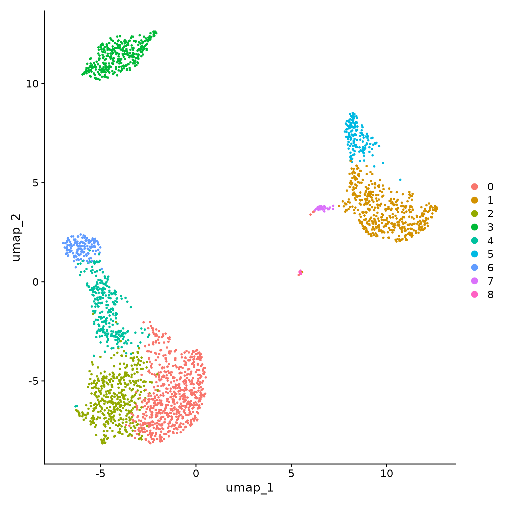

tSNE is slow.tSNE doesn’t scale well to large numbers of cells (10k+)

– UMAP is quite a bit quicker than tSNE

– UMAP can preserve more global structure than tSNE

– UMAP can run on raw data without PCA preprocessing

– UMAP can allow new data to be added to an existing projection

[Rich J M, Moses L, Einarsson P H, et al. The impact of package selection and versioning on single-cell RNA-seq analysis[J]. bioRxiv, 2024.](https://www.biorxiv.org/content/10.1101/2024.04.04.588111v2)

### 3-10:cell Annotation

手动注释与自动化注释的详细比较

|方面	|手动注释	| 自动化注释                      |
|--|--|----------------------------|
|定义	|人工基于标记基因和知识推断| 	算法基于参考数据自动分配身份            |
|依赖性	|依赖研究者经验和文献	| 依赖参考数据集或数据库                |
|速度|	慢，逐簇分析	| 快，一次性处理所有细胞                |
准确性|	高（若经验丰富）	| 中到高（取决于参考质量）               |
|灵活性|	高，可处理未知类型	| 中，受参考限制                    |
|可重复性|	低，因人而异	| 高，算法一致                     |
|适用规模|	小型数据集	| 大型数据集                      |
|工具示例|	Seurat、Scanpy	| SingleR、ScType、CellTypist  |

*Manual annotation:From cluster differentially expressed genes to cluster annotation*

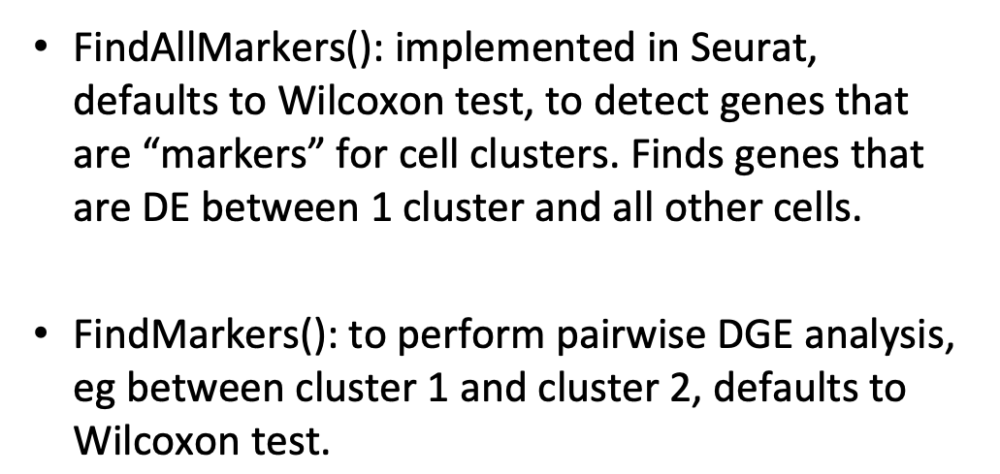
    
    # find markers for every cluster compared to all remaining cells, report only the positive ones
    pbmc.markers <- FindAllMarkers(pbmc, only.pos = TRUE)
    pbmc.markers %>%
        group_by(cluster) %>%
        dplyr::filter(avg_log2FC > 1)
    pbmc.markers %>%
    group_by(cluster) %>%
    dplyr::filter(avg_log2FC > 1) %>%
    slice_head(n = 10) %>%
    ungroup() -> top10
    #DoHeatmap() generates an expression heatmap for given cells and features. In this case, we are plotting the top 20 markers (or all markers if less than 20) for each cluster.
    DoHeatmap(pbmc, features = top10$gene) + NoLegend()

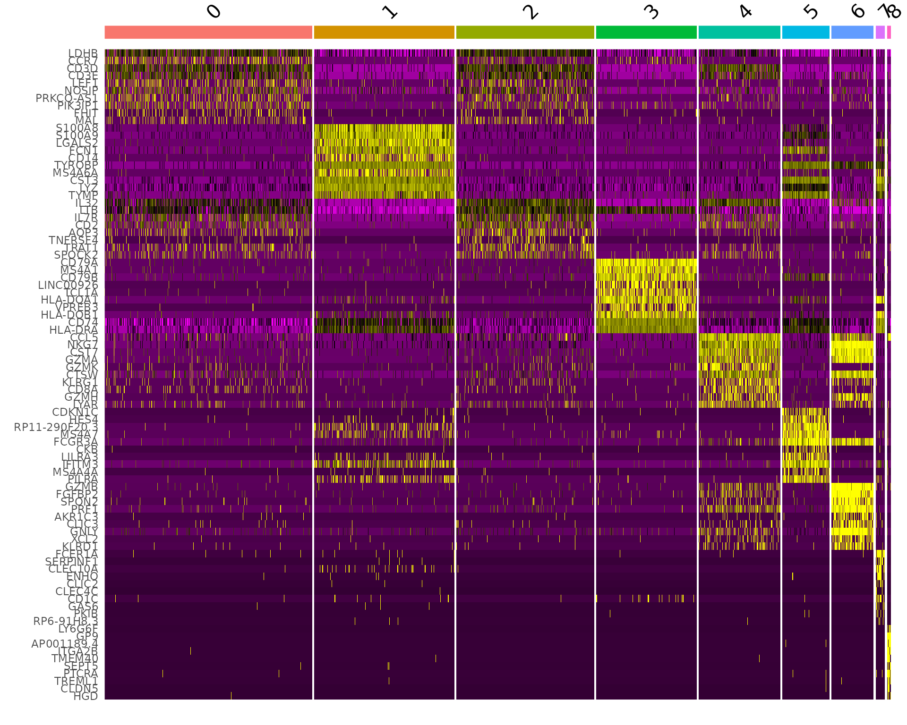

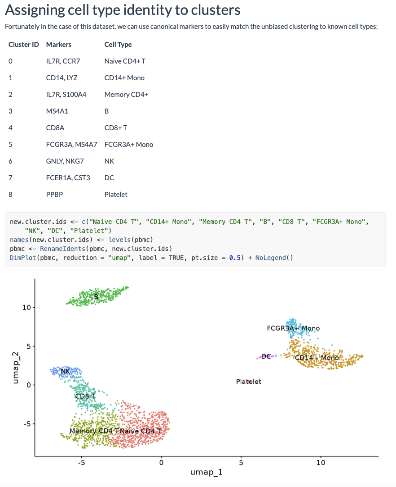

**Our results highlight the efficacy of simple methods, especially the Wilcoxon rank-sum test, Student’s t-test, and logistic regression.**

[Pullin J M, McCarthy D J. A comparison of marker gene selection methods for single-cell RNA sequencing data[J]. Genome Biology, 2024, 25(1): 56.](https://link.springer.com/article/10.1186/s13059-024-03183-0)

*Automated annotation*

**1-Small marker genes(e.g.,size < 20)**

相关软件：**Garnett适合小规模数据（≤50K 细胞），CPU 处理足够快，可自定义 marker**、CellAssign

**2-a larger set of genes:several thousands or more(e.g., size > 100)**

相关软件：**CellTypist（CPU 运行：适用于 中等规模数据（10K~100K 细胞），GPU 运行（使用 PyTorch 或 TensorFlow）：适用于百万级别数据（>1M 细胞）**（内置大规模的细胞类型参考数据库：人类和小鼠，支持Scanpy和Seurat整合）、Clustifyr

[Cheng C, Chen W, Jin H, et al. A review of single-cell rna-seq annotation, integration, and cell–cell communication[J]. Cells, 2023, 12(15): 1970.](https://www.mdpi.com/2073-4409/12/15/1970)

**3-annotation by mapping to a reference**

Azimuth 是 Seurat 开发团队提供的一种 基于参考数据库的自动化单细胞注释工具。它使用 Seurat label transfer（标签转移） 方法，将新的单细胞数据集投影到一个 预训练的参考数据库 上，以实现快速、自动的细胞类型注释。
相关软件:**Azimuth (Seurat超大规模数据（10K~百万细胞）)**、**SingleR中~大型数据（≥10K 细胞）**

### 3-11:batch_effect

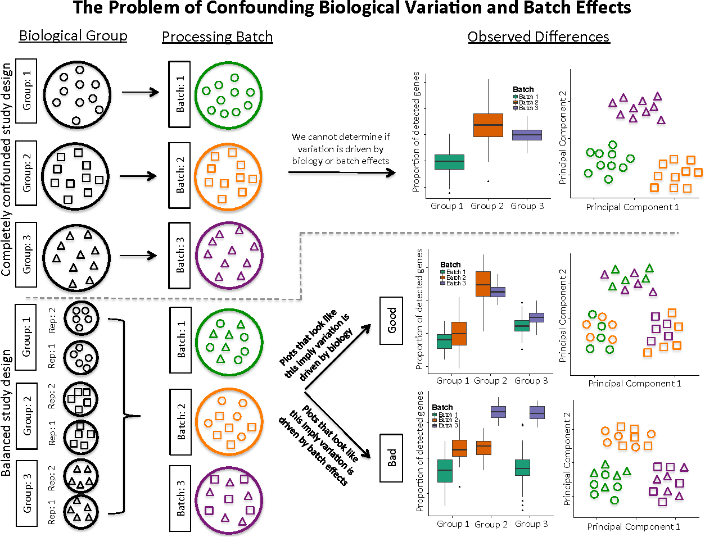

[Hicks S C, Townes F W, Teng M, et al. Missing data and technical variability in single-cell RNA-sequencing experiments[J]. Biostatistics, 2018, 19(4): 562-578.](https://academic.oup.com/biostatistics/article/19/4/562/4599254?login=false#123896284)

整合就是合并来自不同样本的单细胞数据，但是往往合并后数据会自然的按照样本分成cluster，因此要消除这种合并影响

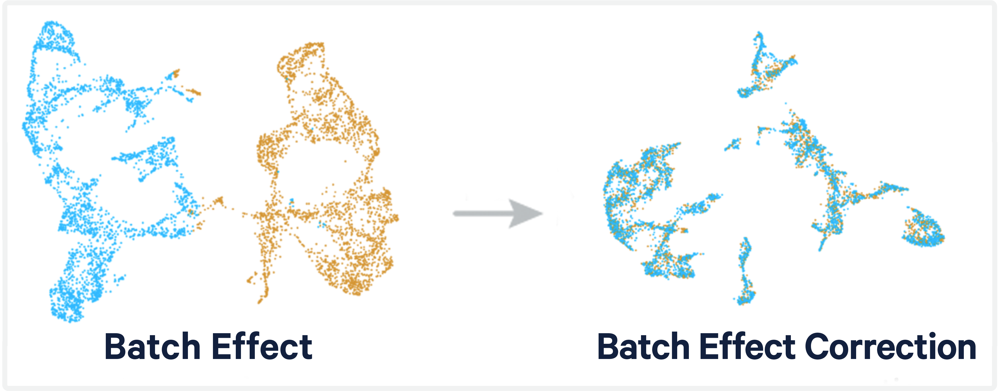

首先在Seurat v5版本代码：https://satijalab.org/seurat/articles/seurat5_integration

    merged_obj=merge(x = pbmc1, y = list(pbmc2, pbmc3))
    merged_obj <- NormalizeData(merged_obj)
    merged_obj <- FindVariableFeatures(merged_obj)
    merged_obj <- ScaleData(merged_obj)
    merged_obj <- RunPCA(merged_obj)
    merged_obj <- IntegrateLayers(object = merged_obj, method = HarmonyIntegration, orig.reduction = "pca", new.reduction = "harmony", verbose = FALSE)
    merged_obj[["RNA"]] <- JoinLayers(merged_obj)

整合的方法有很多：

    Anchor-based CCA integration (method=CCAIntegration)
    Anchor-based RPCA integration (method=RPCAIntegration)
    Harmony (method=HarmonyIntegration)
    FastMNN (method= FastMNNIntegration)
    scVI (method=scVIIntegration)

数据整合的方法分为：

*Global models*：ComBat

*Linear embedding models*：Scanorama、FastMNN、Harmony

*Graph-based methods*：Batch-Balanced k-Nearest Neighbor (BBKNN) method

*Deep learning (DL) approaches*：scVI、scANVI、scGen

几种方法比较下来推荐：**Harmony**

[Tran H T N, Ang K S, Chevrier M, et al. A benchmark of batch-effect correction methods for single-cell RNA sequencing data[J]. Genome biology, 2020, 21: 1-32.](https://link.springer.com/article/10.1186/s13059-019-1850-9)

[Emmanúel Antonsson S, Melsted P. Batch correction methods used in single cell RNA-sequencing analyses are often poorly calibrated[J]. bioRxiv, 2024: 2024.03. 19.585562.](https://www.biorxiv.org/content/10.1101/2024.03.19.585562v1.abstract)

### 3-12:Identification of conserved markers in all conditions

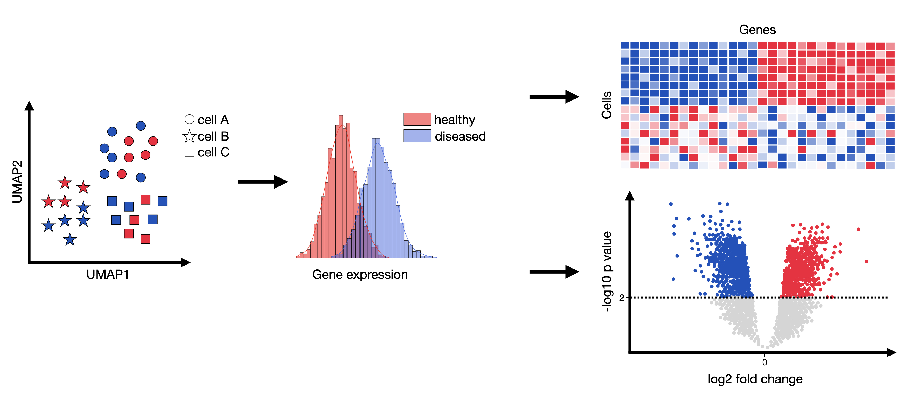

Pseudobulk（伪批量）：有时scRNA-seq实验只有少量样本或没有生物学重复，导致统计检验的假设难以满足，使用 Pseudobulk 分析，将细胞数据聚合为样本级数据

零膨胀效应（Zero Inflation Effect）：许多基因的表达量在scRNA-seq数据中存在过多的零值

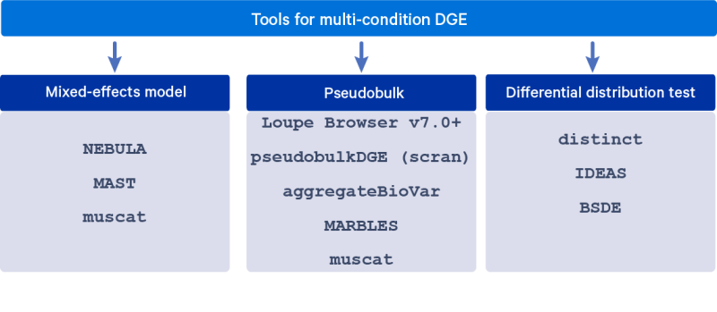

**muscat**多样本多组 scRNA-seq 分析工具（Crowell 等人，2020）为多样本、多组、多（细胞）亚群 scRNA-seq 数据中的差异表达（DS）分析提供了多种方法和可视化工具，包括细胞水平的混合模型、基于聚合‘伪批量’数据的方法，以及一个灵活的模拟平台，可以模拟单样本和多样本 scRNA-seq 数据。

[Crowell H L, Soneson C, Germain P L, et al. Muscat detects subpopulation-specific state transitions from multi-sample multi-condition single-cell transcriptomics data[J]. Nature communications, 2020, 11(1): 6077.](https://www.nature.com/articles/s41467-020-19894-4)

https://hbctraining.github.io/scRNA-seq_online/lessons/09_merged_SC_marker_identification.html

## 4.资源链接

**A useful tool to estimate how many cells to sequence has been developed by the Satija Lab**:https://satijalab.org/howmanycells/

**It is difficult to precisely estimate how much an experiment will cost, although we point to this tool from the Satija Lab as a starting point**:https://satijalab.org/costpercell/
    
**Single-cell best practices**:https://www.sc-best-practices.org/

**Analysis of single cell RNA-seq data**:https://www.singlecellcourse.org/index.html

**SIB course Single Cell Transcriptomics**:https://sib-swiss.github.io/single-cell-training/

**Seurat - Guided Clustering Tutorial**：https://satijalab.org/seurat/articles/pbmc3k_tutorial.html

**Scanpy – Single-Cell Analysis in Python**:https://scanpy.readthedocs.io/en/stable/index.html#

**Orchestrating Single-Cell Analysis with Bioconductor**:https://bioconductor.org/books/release/OSCA/

**Single-cell RNA-seq data analysis workshop**:https://hbctraining.github.io/scRNA-seq_online/schedule/links-to-lessons.html

