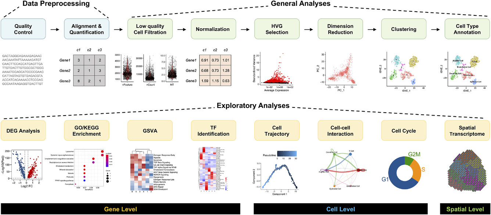

# 单细胞测序学习笔记

## 1.单核测序（Single-nucleus RNA-seq）+单细胞RNA测序(Single-Cell RNA-seq)    
已有研究表明，细胞核能够准确反映细胞的所有转录模式在实验设计中选择单细胞还是单核测序主要由组织样本类型驱动，单细胞测序高度依赖新鲜组织，需保持细胞活性。

 **样本状态：是新鲜组织还是冷冻/存档样本？**
        冷冻 → 单核测序；
        新鲜 → 单细胞测序可行。
    
 **组织类型：解离是否会导致特定细胞类型丢失？**
        易损组织（如大脑） → 单核测序；
        易解离（如血液） → 单细胞测序。
    
 **研究目标：关注转录活性还是翻译产物？**
        转录调控 → 单核测序；
        蛋白质合成 → 单细胞测序。

|	| 单核测序 (snRNA-seq)	                 | 单细胞测序 (scRNA-seq)                  |
|----|-----------------------------------|------------------------------------|
|目标	| 分离和富集细胞核                          | 	分离和富集完整单细胞                        |
|样本起始状态| 	新鲜或冷冻组织                          | 	通常需要新鲜组织                          |
|主要步骤| 	组织破碎 → 核分离 → 核富集 → RNA提取 → 文库构建	 | 组织解离 → 单细胞悬液 → 细胞富集 → RNA提取 → 文库构建 |
|下游测序| 	与单细胞测序类似（如10X Genomics）	         | 与单核测序类似（如10X Genomics）             |
|内含子比例	| 高（>50%）| 	低（<10%）                           |

## 2.工作流程

包括分离单细胞（或细胞核）、将RNA转化为cDNA、制备测序文库（Illumina）并进行测序。 主要在通量（每次实验捕获多少细胞）、定量类型（全长或基于标签）以及成本方面有所不同。

SMART-seq2 是一种流行的低通量方法，提供全长转录本定量。它非常适合详细研究较小群体的细胞（例如，差异性异构体使用、低表达转录本的表征）。

Chromium 是一种流行的高通量方法，使用唯一分子标识符（UMI）进行转录本定量（从3’端或5’端）。它非常适合研究高度异质的组织并大规模采样大量细胞。

## 3.bioinformatics

**Roadmap for typical single-cell RNA sequencing data analysis**

**Overview of the analysis modules for single-cell RNA sequencing data analysis**

### 3-1：mapping

Raw data processing pipelines such as Cell Ranger、STARsolo, Kallisto, Alevin, and Alevin-fry,Summary of the results for each evaluated section of interest and mapper. Good results are coloured in green, intermediate in yellow, and poor results in red.

[Brüning R S, Tombor L, Schulz M H, et al. Comparative analysis of common alignment tools for single-cell RNA sequencing[J]. Gigascience, 2022, 11: giac001.](https://academic.oup.com/gigascience/article/doi/10.1093/gigascience/giac001/6515741?login=true)

### 3-2:considerations_in_Quality control

常见的细胞质量控制 (QC) 步骤主要基于以下三个指标：

        每个条形码的 UMI 计数深度 (count depth)
        每个条形码检测到的基因数 (gene count per barcode)
        每个条形码中线粒体基因 UMI 计数的比例 (fraction of mitochondrial counts per barcode)

这些异常条形码可能对应于：

        凋亡细胞 (dying cells)
        细胞膜破损的细胞 (cells with broken membranes)
        多胞 (doublets, 即两个或多个细胞的 mRNA 被误认为是单个细胞的表达数据)

如果某个条形码的 UMI 计数低、检测到的基因数少、但线粒体基因占比高，则可能是细胞膜破损导致胞质mRNA泄漏，仅剩线粒体mRNA被保留下来。 

相反，UMI计数异常高、检测到的基因数异常多，可能代表多胞，通常需要设定高UMI计数阈值来过滤掉潜在的多胞。

线粒体基因比例较高的细胞，可能参与呼吸代谢 (respiratory processes)，并不一定是死细胞。

UMI计数较低、基因数较少的细胞，可能属于静息 (quiescent) 细胞群，并非一定是低质量细胞。

UMI 计数较高的细胞，可能只是细胞体积较大，并不一定是多胞。

因此，在设定QC阈值时，应该联合多个QC指标进行筛选，并尽量使用宽松的阈值，以免误删真正的细胞群体。未来，可以使用多变量QC依赖性模型来提高QC筛选的灵敏度。

在单细胞 RNA 测序 (scRNA-seq) 中，空胞指的是： 含有条形码 (barcode) 但没有真正的细胞，仅含有少量环境 RNA (ambient RNA)。 这些 RNA 可能来源于细胞裂解后的游离 RNA，在实验过程中随机进入微滴 (droplet) 或孔板 (well) 中。

[Kim G D, Lim C, Park J. A practical handbook on single-cell RNA sequencing data quality control and downstream analysis[J]. Molecules and Cells, 2024, 47(9): 100103.](https://www.sciencedirect.com/science/article/pii/S1016847824001286)

*A recent systematic survey of scRNA-seq data suggested that a mitochondrial proportion threshold of 10% is appropriate to distinguish between healthy and low-quality cells in most human tissues, while in mouse tissues, the recommended threshold is 5%.*

[Osorio D, Cai J J. Systematic determination of the mitochondrial proportion in human and mice tissues for single-cell RNA-sequencing data quality control[J]. Bioinformatics, 2021, 37(7): 963-967.](https://academic.oup.com/bioinformatics/article/37/7/963/5896986?login=false)

### highly_variable_gene

*HVG selection methods can be classified into four categories:*

*Classification of baseline HVG selection methods.*

[Zhao R, Lu J, Zhou W, et al. A systematic evaluation of highly variable gene selection methods for single-cell RNA-sequencing[J]. bioRxiv, 2024: 2024.08. 25.608519.](https://www.biorxiv.org/content/10.1101/2024.08.25.608519v1.abstract)

### batch_effect

[Hicks S C, Townes F W, Teng M, et al. Missing data and technical variability in single-cell RNA-sequencing experiments[J]. Biostatistics, 2018, 19(4): 562-578.](https://academic.oup.com/biostatistics/article/19/4/562/4599254?login=false#123896284)

## 4.资源链接

**A useful tool to estimate how many cells to sequence has been developed by the Satija Lab**:https://satijalab.org/howmanycells/

**It is difficult to precisely estimate how much an experiment will cost, although we point to this tool from the Satija Lab as a starting point**:https://satijalab.org/costpercell/
    
**Single-cell best practices**:https://www.sc-best-practices.org/preamble.html

**Analysis of single cell RNA-seq data**:https://www.singlecellcourse.org/index.html
