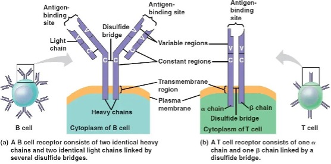

B细胞受体(BCR)和T细胞受体(T-cell receptor,TCR)的结构，分别位于B细胞和T细胞的细胞膜上

**图(a)** BCR由两条相同的重链（heavy chains）和两条相同的轻链（light chains）构成
<ul>
<li>可变区（Variable regions）：重链和轻链的可变区域负责抗原识别，确定BCR的特异性</li>
<li>恒定区（Constant regions）：这些区域在重链中是固定的，决定了抗体的类型(如 IgG、IgM 等)</li>
<li>功能：BCR 主要用于识别和结合抗原，并通过 信号转导 启动 B 细胞的免疫反应，促进抗体的生产</li>
</ul>

**图(b)** TCR 由一条 α 链（alpha chain）和一条 β 链（beta chain）组成，通过二硫键连接。与BCR不同，TCR不直接结合抗原，而是与MHC（主要组织相容性复合体）-抗原复合物结合。
<ul>
<li>可变区（Variable regions）：与BCR类似，TCR 的 α 链和 β 链也有可变区，决定 TCR 的特异性</li>
<li>恒定区（Constant regions）：TCR的恒定区在 α 链和 β 链之间通过二硫键连接，保证了结构的稳定性</li>
<li>功能:TCR 主要用于识别由 MHC 分子呈递的抗原肽，触发 T 细胞的免疫应答，涉及 细胞毒性反应或辅助免疫反应</li>
</ul>

3.	BCR 和 TCR 的 V(D)J 重排与可变区、恒定区的关系

可变区（V 区）：由 V(D)J 重排 的结果产生，负责抗原的结合和识别。
对于 TCR，V 区是由 V 和 J 基因片段（TCR α 链）或 V、D、J 基因片段（TCR β 链）重排形成。
对于 BCR，重链的 V 区是由 V、D、J 重排 形成，轻链的 V 区是由 V、J 重排 形成。
恒定区（C 区）：不参与抗原识别，但决定了受体的功能。
TCR 的恒定区：TCR α 链和 β 链的恒定区保持相对稳定，参与 TCR 结构的稳定性。
BCR 的恒定区：BCR 重链的恒定区决定了抗体的类型（IgG、IgM 等），并决定了它与免疫系统其他部分的相互作用。

4.	TCR/BCR：DNA 和 RNA 测序
 
5.	TCR：VDJ
variable (V), diversity (D) (for the β-chain only), joining (J) and constant (C) gene segments V（可变）区、D（多样性）区和 J（连接）区的重排序列
 
上图就是从DNA到RNA的过程：TRB（T-cell receptor β-chains）、TRA（T-cell receptor α）

6.	CDR（Complementarity-Determining Regions，互补决定区）
TCR（T 细胞受体） 和 BCR（B 细胞受体/抗体） 中最关键的 抗原结合区域。直接与抗原接触、决定抗原识别的特异性。每条受体链（如 TCR 的 α 链和 β 链，抗体的重链和轻链）都包含：3 个 CDR 区域：CDR1、CDR2、CDR3。夹在 4 个 FR（框架区，Framework Regions） 之间
CDR1 & CDR2：
•	来源于 V 基因片段 的编码区域
•	在结构上较为保守，但对 MHC 分子有辅助结合作用
CDR3（最关键）：
•	来源于 V(D)J 重排的连接区域：
o	TCR α 链的 CDR3：V–J 连接
o	TCR β 链的 CDR3：V–D–J 连接
•	包含最多样化的序列，是 识别抗原肽本身 的核心区域
•	是分析 TCR/BCR 克隆多样性 和 免疫谱系追踪 的主要序列

7.	三个 CDR 的区别和功能
 
TCR CDR1 + CDR2 + CDR3 总长度：约 26-44 个氨基酸，取决于 α 链和 β 链的长度
BCR CDR1 + CDR2 + CDR3 总长度：约 26-44 个氨基酸，重链（IgH）通常较长，而轻链（IgK/IgL）较短

8.	Exemplary companies providing immune repertoire products and services
 
Rosati E, Dowds C M, Liaskou E, et al. Overview of methodologies for T-cell receptor repertoire analysis[J]. BMC biotechnology, 2017, 17: 1-16.
