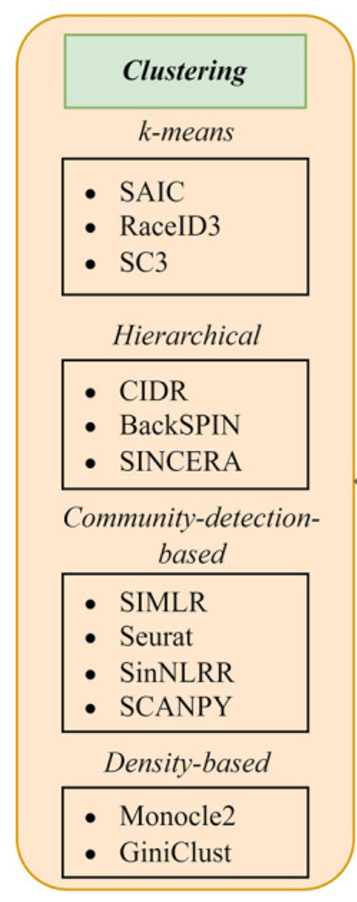
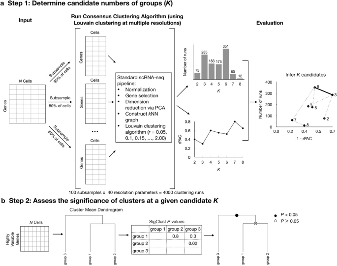
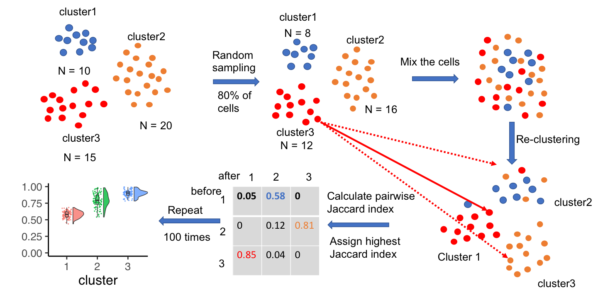
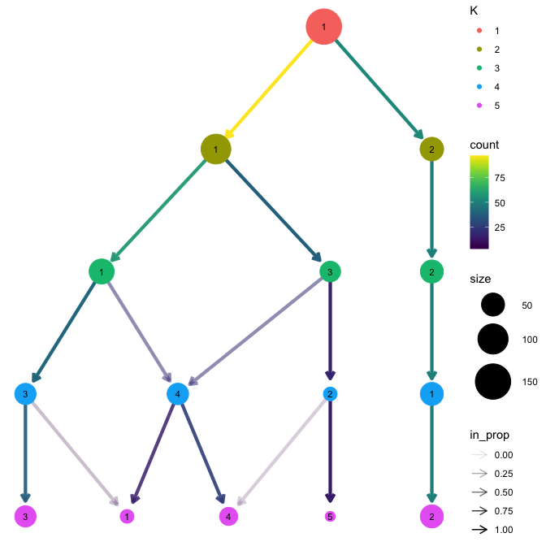

If you are a beginner, please go here [single_cell](https://github.com/bio-apple/single_cell).

## 1:聚类

### 1-1:算法分类

[Zhang S, Li X, Lin J, et al. Review of single-cell RNA-seq data clustering for cell-type identification and characterization[J]. Rna, 2023, 29(5): 517-530.](https://rnajournal.cshlp.org/content/29/5/517.long)

four popular existing clustering workflows:

    Seurat’s implementation of the Louvain algorithm (denoted here as Seurat-Louvain)
    Seurat’s implementation of the Leiden algorithm (denoted here as Seurat-Leiden)
    Monocle’s cluster_cells function
    SC3’s consensus clustering algorithm

[Grabski I N, Street K, Irizarry R A. Significance analysis for clustering with single-cell RNA-sequencing data[J]. Nature Methods, 2023, 20(8): 1196-1202.](https://pmc.ncbi.nlm.nih.gov/articles/PMC11282907/)

### 1-2:算法评估Davies-Bouldin, ASW, NMI, ARI and V-Measure

**Davies-Bouldin** 指数是一种用于评估聚类质量的指标，特别用于衡量聚类的紧密性（cohesion）和分离度（separation）。DBI 的值越小，表示聚类质量越好。

**Average Silhouette Width**(ASW)是另一种用于评估聚类质量的指标，它考虑了聚类内部的一致性和聚类之间的分离性。ASW 值范围从 -1 到 1，越接近 1 表示聚类效果越好。

**Normalized Mutual Information** (NMI)是一种衡量聚类结果与已知标签之间相似度的指标。NMI 衡量的是聚类结果与真实标签（如已知的细胞类型）之间共享的信息量。NMI 的值介于 0 和 1 之间，0 表示完全无关，1 表示完全一致。

**Adjusted Rand Index** (ARI) 是一种广泛用于评估聚类结果与真实标签之间相似度的指标。它不仅考虑了聚类内的一致性，还考虑了聚类之间的差异性。ARI 进行调整，以消除随机聚类带来的影响。ARI 计算聚类标签与真实标签之间的相似性，得分范围从 -1 到 1，值越大表示聚类与真实标签的一致性越好。

[Yu Z, Su Y, Lu Y, et al. Topological identification and interpretation for single-cell gene regulation elucidation across multiple platforms using scMGCA[J]. Nature Communications, 2023, 14(1): 400.](https://pmc.ncbi.nlm.nih.gov/articles/PMC9877026/)

### 1-3:拓展阅读

文献中比较了12 clustering algorithms算法，认为**SC3** and **Seurat** showing the most favorable results

[Duò A, Robinson M D, Soneson C. A systematic performance evaluation of clustering methods for single-cell RNA-seq data[J]. F1000Research, 2020, 7: 1141.](https://pmc.ncbi.nlm.nih.gov/articles/PMC6134335/)

本文检查了15种不同的单细胞RNA-seq聚类算法在八个不同癌症数据集上的聚类性能。我们的结果表明，单细胞RNA-seq聚类算法按性能分为不同组别，在非恶性细胞上表现最佳的三个算法是：Seurat、bigSCale和Cell Ranger。然而，对于恶性细胞，另外两个算法通常表现更好，即Monocle和SC3。它们检测已知稀有细胞类型的能力也名列前茅，与Seurat并列。我们的方法和结果可被广泛的从业者用于分析癌症研究中的单细胞转录组数据。

[Mahalanabis A, Turinsky A L, Husić M, et al. Evaluation of single-cell RNA-seq clustering algorithms on cancer tumor datasets[J]. Computational and Structural Biotechnology Journal, 2022, 20: 6375-6387.](https://pmc.ncbi.nlm.nih.gov/articles/PMC9677128/)

如何选择最佳cluster数量，MultiK基于Seurat，总体上获取最佳的resolution parameters (from 0.05 to 2 with an increment of 0.05).原理如下：

[Liu S, Thennavan A, Garay J P, et al. MultiK: an automated tool to determine optimal cluster numbers in single-cell RNA sequencing data[J]. Genome biology, 2021, 22: 1-21.](https://pmc.ncbi.nlm.nih.gov/articles/PMC8375188/)

[Tang M, Kaymaz Y, Logeman B L, et al. Evaluating single-cell cluster stability using the Jaccard similarity index[J]. Bioinformatics, 2021, 37(15): 2212-2214.](https://pmc.ncbi.nlm.nih.gov/articles/PMC8352506/)

clustree:https://lazappi.github.io/clustree/

**Seurat** Plot clusters as a tree:https://satijalab.org/seurat/reference/plotclustertree

Plotting clustering trees:https://cran.r-project.org/web/packages/clustree/vignettes/clustree.html

[Traag V A, Waltman L, Van Eck N J. From Louvain to Leiden: guaranteeing well-connected communities[J]. Scientific reports, 2019, 9(1): 1-12.](https://pmc.ncbi.nlm.nih.gov/articles/PMC6435756/)
